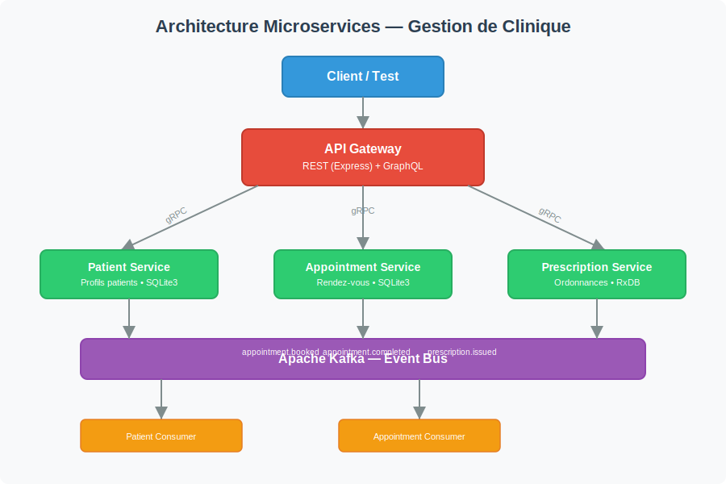

# Système de Gestion de Clinique Intelligente

Architecture microservices pour la gestion médicale — patients, rendez-vous et ordonnances.

## Architecture



Trois microservices indépendants, une API Gateway, un broker Kafka 4.0 (KRaft) et des bases de données séparées.

## Microservices

| Service | Responsabilité | Base de données | Port gRPC |
|---|---|---|---|
| **Patient Service** | Profils patients, dossiers médicaux | SQLite3 | 50051 |
| **Appointment Service** | Réservation et gestion des RDV | SQLite3 | 50052 |
| **Prescription Service** | Ordonnances et médicaments | RxDB (NoSQL) | 50053 |
| **API Gateway** | Point d'entrée REST + GraphQL | — | 3000 (HTTP) |

## Communication

- **REST** → Opérations CRUD classiques via l'API Gateway
- **GraphQL** → Requêtes flexibles (patients, rendez-vous, ordonnances)
- **gRPC** → Communication entre l'API Gateway et les microservices
- **Kafka** → Communication asynchrone entre microservices

## Topics Kafka

| Topic | Producteur | Consommateur | Payload |
|---|---|---|---|
| `appointment.booked` | Appointment Svc | Prescription Svc | `{ appointmentId, patientId, doctor, date }` |
| `appointment.completed` | Appointment Svc | Patient Svc | `{ appointmentId, patientId }` |
| `prescription.issued` | Prescription Svc | Appointment Svc | `{ prescriptionId, patientId, drug }` |

## Endpoints REST

### Patients
| Méthode | Endpoint | Description |
|---|---|---|
| `POST` | `/api/patients` | Créer un patient |
| `GET` | `/api/patients` | Lister les patients |
| `GET` | `/api/patients/:id` | Consulter un patient |
| `PUT` | `/api/patients/:id` | Modifier un patient |
| `DELETE` | `/api/patients/:id` | Supprimer un patient |

### Rendez-vous
| Méthode | Endpoint | Description |
|---|---|---|
| `POST` | `/api/appointments` | Créer un RDV |
| `GET` | `/api/appointments` | Lister les RDV (`?patient_id=`) |
| `GET` | `/api/appointments/:id` | Consulter un RDV |
| `POST` | `/api/appointments/:id/complete` | Marquer comme terminé |
| `POST` | `/api/appointments/:id/cancel` | Annuler un RDV |

### Ordonnances
| Méthode | Endpoint | Description |
|---|---|---|
| `POST` | `/api/prescriptions` | Créer une ordonnance |
| `GET` | `/api/prescriptions` | Lister les ordonnances (`?patient_id=`) |
| `GET` | `/api/prescriptions/:id` | Consulter une ordonnance |

## Schéma GraphQL

```graphql
type Patient {
  id:            ID!
  name:          String!
  birth_date:    String!
  email:         String!
  phone:         String!
}

type Appointment {
  id:         ID!
  patient_id: String!
  doctor:     String!
  date:       String!
  status:     String!
}

type Prescription {
  id:             ID!
  patient_id:     String!
  appointment_id: String!
  drug:           String!
  dosage:         String!
  instructions:   String!
}

type Query {
  patient(id: ID!):                       Patient
  patients:                               [Patient!]!
  appointment(id: ID!):                   Appointment
  appointmentsByPatient(patient_id: ID!):  [Appointment!]!
  prescription(id: ID!):                  Prescription
  prescriptionsByPatient(patient_id: ID!): [Prescription!]!
}

type Mutation {
  createPatient(name: String!, birth_date: String!, email: String!, phone: String!): Patient!
  updatePatient(id: ID!, name: String, email: String, phone: String): Patient!
  deletePatient(id: ID!): Boolean!
  bookAppointment(patient_id: ID!, doctor: String!, date: String!): Appointment!
  completeAppointment(id: ID!): Appointment!
  cancelAppointment(id: ID!): Boolean!
  createPrescription(patient_id: ID!, appointment_id: ID!, drug: String!, dosage: String!, instructions: String): Prescription!
}
```

## Installation et exécution

### Prérequis
- Node.js 18+
- Docker (optionnel, pour Kafka 4.0)

### Sans Docker

1. Démarrer Kafka 4.0 (KRaft) :
```bash
docker run --name kafka -p 9092:9092 apache/kafka:4.0.0
```

2. Installer les dépendances pour chaque service :
```bash
cd patient-service && npm install
cd ../appointment-service && npm install
cd ../prescription-service && npm install
cd ../api-gateway && npm install
```

3. Démarrer les microservices (dans des terminaux séparés) :
```bash
cd patient-service && node index.js
cd appointment-service && node index.js
cd prescription-service && node index.js
```

4. Démarrer l'API Gateway :
```bash
cd api-gateway && node index.js
```

5. Accéder à :
   - API Gateway : http://localhost:3000
   - REST : http://localhost:3000/api
   - GraphQL : http://localhost:3000/graphql

### Avec Docker Compose

```bash
docker-compose up --build
```

### Exemple de scénario

```bash
# 1. Créer un patient
curl -X POST http://localhost:3000/api/patients \
  -H "Content-Type: application/json" \
  -d '{"name":"John Doe","birth_date":"1990-01-01","email":"john@example.com","phone":"+216123456"}'

# 2. Créer un rendez-vous
curl -X POST http://localhost:3000/api/appointments \
  -H "Content-Type: application/json" \
  -d '{"patient_id":"<PATIENT_ID>","doctor":"Dr. Smith","date":"2025-06-20"}'

# 3. GraphQL — tout en un
curl -X POST http://localhost:3000/graphql \
  -H "Content-Type: application/json" \
  -d '{"query":"{ patients { id name appointments { id doctor date status } } }"}'
```

## Fichiers .proto

Les contrats gRPC sont définis dans le dossier `proto/` :
- `proto/patient.proto` — Service Patient
- `proto/appointment.proto` — Service Appointment
- `proto/prescription.proto` — Service Prescription

## Structure du projet

```
├── proto/
│   ├── patient.proto
│   ├── appointment.proto
│   └── prescription.proto
├── api-gateway/
│   ├── src/
│   │   ├── rest/routes.js
│   │   ├── graphql/
│   │   │   ├── schema.js
│   │   │   └── resolvers.js
│   │   └── grpc-clients/index.js
│   └── index.js
├── patient-service/
│   ├── src/
│   │   ├── grpc-server.js
│   │   ├── db.js
│   │   └── kafka/producer.js
│   └── index.js
├── appointment-service/
│   ├── src/
│   │   ├── grpc-server.js
│   │   ├── db.js
│   │   └── kafka/
│   │       ├── producer.js
│   │       └── consumer.js
│   └── index.js
├── prescription-service/
│   ├── src/
│   │   ├── grpc-server.js
│   │   ├── db.js
│   │   └── kafka/consumer.js
│   └── index.js
├── docker-compose.yml
└── README.md
```

## Équipe

- **Elaa Hmida** (`elaa9`) — Développeur
- **HMIDA Omar** (`HMIDA9`) — Développeur
